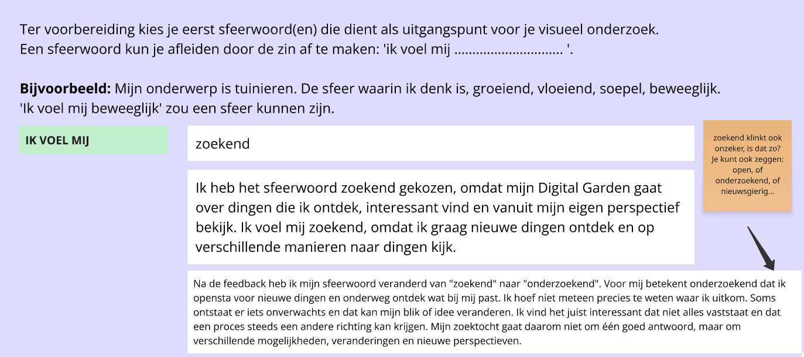
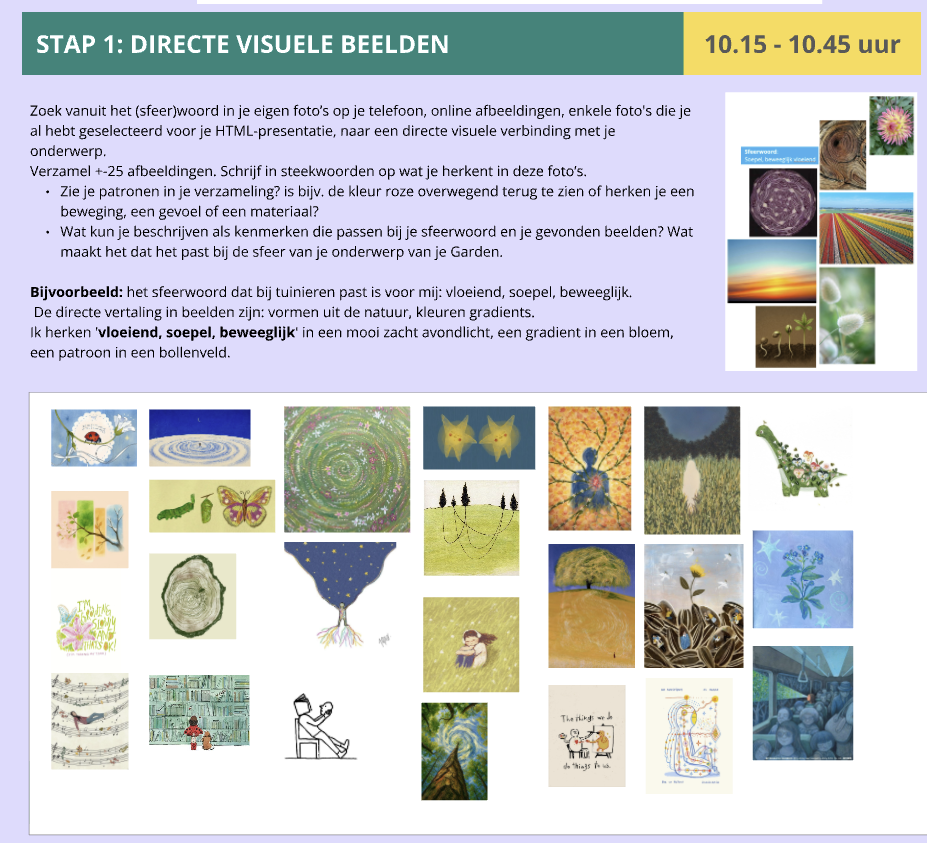
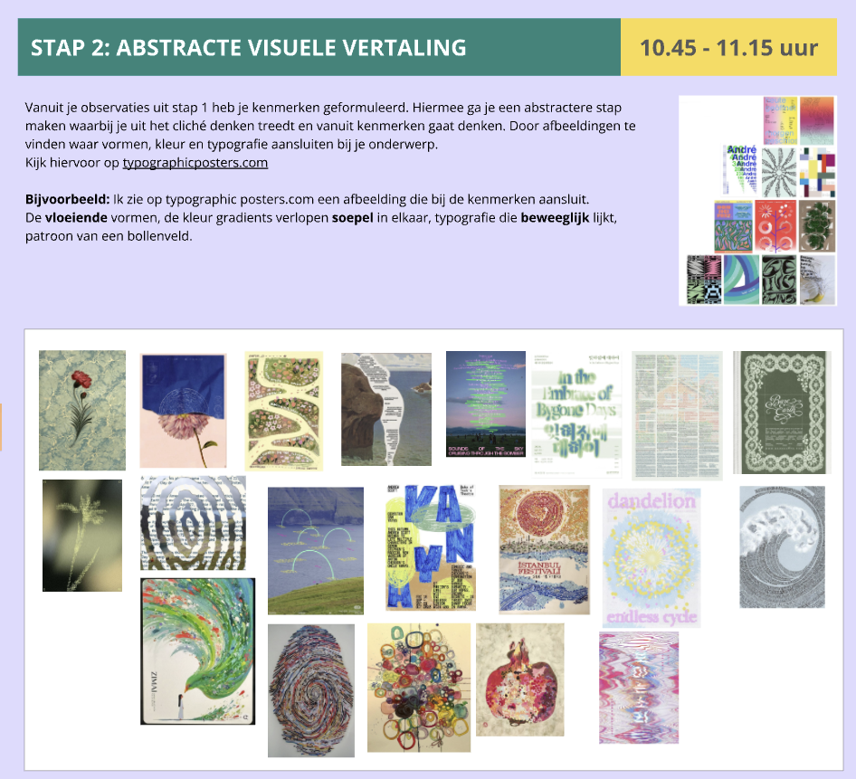
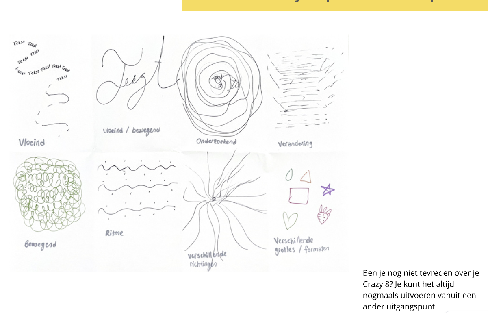
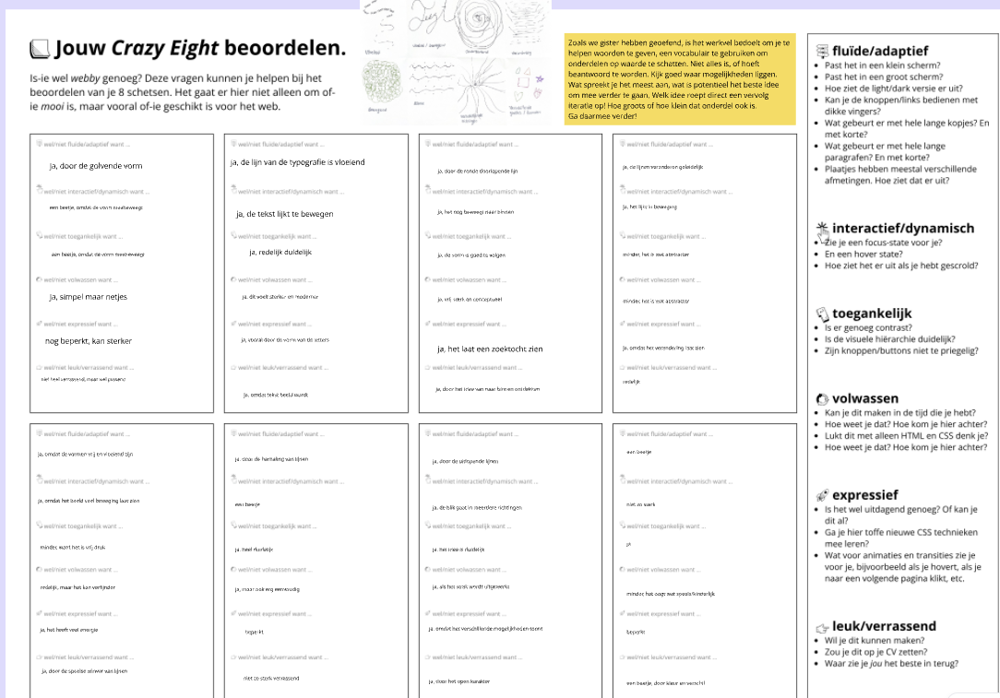
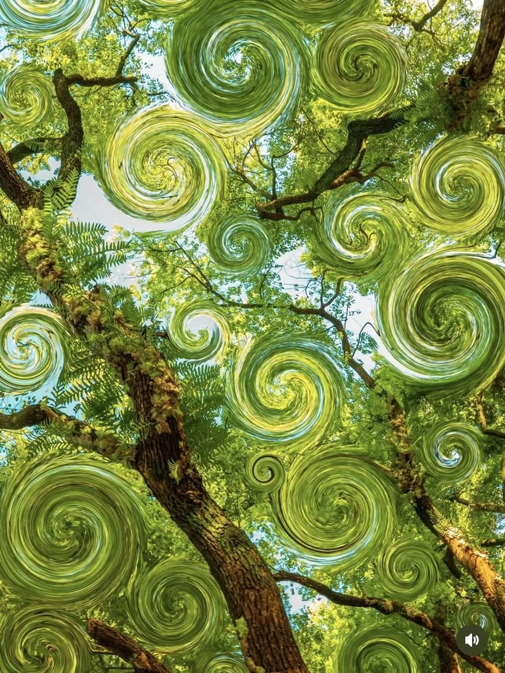

# Model

## Learning Log
Op 11 september heb ik mijn README gekoppeld aan VSCodium. Daarna ben ik mijn Learning Log ook voor de eerdere dagen gaan invullen. Ik probeer alles nog terug te halen, maar er missen nog een paar dingen 

### 31 aug - Kickoff

Een fork van de model repository gemaakt en gepubliceerd via mijn eigen Github omgeving...

### 7 september

Vandaag hebben we de tekst *A Brief History & Ethos of the Digital Garden* gelezen.

Een digital garden is een persoonlijke plek op het internet waar je ideeën, interesses, notities en dingen die je leert kunt verzamelen. Het verschil met een gewone blog is dat een digital garden niet alleen uit afgewerkte berichten bestaat. Je kunt ook ideeën delen die nog niet helemaal af zijn en deze later aanpassen.
De inhoud hoeft ook niet op datum te staan. Onderwerpen kunnen met elkaar verbonden worden en zo ontstaat er langzaam een soort netwerk van ideeën. Een digital garden groeit dus steeds verder en verandert mee met wat je leert en ontdekt.

Daarna hebben we verschillende persoonlijke websites bekeken en beoordeeld op punten zoals fluid/adaptief, interactief, toegankelijkheid, expressief en verrassend.

**silly.possiblyaxolotl.com**
-Fluid/adaptief: de website heeft veel onderdelen en links, maar blijft duidelijk opgebouwd.
-Interactief/dynamisch: er zijn veel links en onderdelen waar je op kunt klikken.
-Toegankelijkheid: de tekst is duidelijk, maar door de drukke stijl kan het soms wat onrustig zijn.
-Expressief: heel sterk. De website heeft duidelijk een eigen stijl en persoonlijkheid.
-Leuk/verrassend: ja, omdat het heel anders voelt dan een normale website.

**bonics.org/aboutme**
-Fluid/adaptief: de pagina bestaat uit veel losse visuele elementen.
-Interactief/dynamisch: er zijn verschillende buttons en onderdelen om te ontdekken.
-Toegankelijkheid: door de vele afbeeldingen is niet alles meteen even duidelijk.
-Expressief: heel persoonlijk en creatief vormgegeven.
-Leuk/verrassend: ja, omdat je steeds nieuwe kleine dingen tegenkomt.

Checkout

1.Een digital garden is een persoonlijke website waar je ideeën, interesses en dingen die je leert kunt verzamelen. Het verschil met een gewone website is dat niet alles af hoeft te zijn. Je kunt dingen later veranderen en verder ontwikkelen.

2.Een website voelt voor mij 'webby' als je merkt dat er echt iets persoonlijks en creatiefs in zit. Niet alles hoeft strak en standaard te zijn. Ik vond vooral websites inspirerend waar je veel kleine dingen kunt ontdekken en waar de maker duidelijk zijn eigen stijl laat zien.

3.Voor mijn eigen digital garden wil ik beginnen met dingen die bij mij passen, zoals foto's, boeken, inspiratie en dingen die ik leer. Ik wil eerst een simpele persoonlijke website maken en later kijken hoe ik die verder kan uitbreiden.

### 9 september

Vandaag heb ik mijn eerste presentatie over mijn Digital Garden gemaakt. Daarna heb ik via Teams met Giel gesproken en hebben we elkaar vragen gesteld over onze ideeën en onderwerpen.

**Wat is voor jou de essentie van wat je hebt gepresenteerd?**  
Voor mij gaat het vooral over ontdekken, veranderen en dingen die bij mij passen. Ik wil laten zien hoe mijn interesses en ideeën zich ontwikkelen.

**Welke woorden uit de kwaliteitenlijst passen bij je onderwerp?**  
Onderzoekend, persoonlijk, open en rustig.

**Heeft de ander een aanvulling op je onderwerp?**  
Ja, door het gesprek kreeg ik het idee dat ik mijn onderwerp niet te groot hoef te maken. Ik kan beginnen met een paar persoonlijke dingen en het later uitbreiden.

**Wat is het karakter of gevoel dat bij je onderwerp past?**  
Persoonlijk, rustig, nieuwsgierig en een beetje speels.

**Welke inspiratie haal je uit je 25 afbeeldingen?**  
Ik zie veel natuurlijke vormen, verschillende kleuren, typografie en beelden die niet helemaal perfect of strak zijn. Dat past goed bij het idee van ontdekken en veranderen.

**Wat wil je vertellen met je Digital Garden?**  
Ik wil vooral laten zien wat mij interesseert en wat ik onderweg ontdek. Ik wil dit doen met eigen foto's, korte teksten, beelden en misschien kleine interactieve dingen.

**Mijn eerste idee:**  
Ik wil mijn Digital Garden laten gaan over mijn interesses, ontdekkingen en persoonlijke ontwikkeling.  
Ik wil dat laten zien door foto's, korte teksten en beelden te tonen.  
Ik begin met eigen content over mijn favoriete boeken, foto's en mijn boom.  
Later kan ik mijn Garden verder uitbreiden met nieuwe dingen die ik leer, maak of ontdek.

Daarna heb ik in Miro visueel onderzoek gedaan voor mijn Digital Garden. Ik begon met het sfeerwoord ´´zoekend´´, maar na feedback heb ik dit veranderd naar ´´onderzoekend´´.

Ik heb op Pinterest ongeveer 25 afbeeldingen verzameld die bij mijn onderwerp en sfeer passen. Ik heb vooral gekeken naar vormen, kleuren, beweging, ritme en verschillende stijlen.

Uit deze beelden heb ik kenmerken gehaald zoals vloeiend, bewegend, herhaling, verschillende richtingen en onverwachte vormen. Daarna heb ik met deze kenmerken kleine schetsen gemaakt.

Als laatste heb ik mijn schetsen beoordeeld op punten zoals toegankelijkheid, interactie, expressie en of het verrassend genoeg was. Zo kon ik beter zien welke ideeën ik verder wil gebruiken voor mijn Digital Garden.

### Check-out

Het Visual Research helpt mij om van inspiratie naar een duidelijker visueel idee te gaan.

Mijn Digital Garden gaat over dingen die ik ontdek en interessant vind. Ik wil dit laten zien met foto’s, korte teksten en kleine interactieve elementen.

Van mijn Crazy 8 wil ik vooral het idee met vloeiende lijnen en verschillende richtingen verder onderzoeken.
### 11 september

Vandaag heb ik verder nagedacht over het concept van mijn Digital Garden. Mijn eerste idee was om te werken met een groot beeld van een boom, waarin ik boeken wilde plaatsen. Ik dacht eraan om de boeken klikbaar te maken en de pagina’s als het ware om te slaan, zodat de bezoeker per boek iets kon lezen of ontdekken. Op die manier wilde ik verschillende onderdelen van mijn Garden laten zien.

Na feedback van Sanne ben ik opnieuw naar mijn concept gaan kijken. Zij zei dat de combinatie van een boom en boeken misschien te veel verschillende elementen tegelijk bevatte en daardoor wat druk of onduidelijk kon worden. Daardoor ben ik opnieuw gaan nadenken over wat ik precies wilde laten zien en welke vorm daar het beste bij past.

Daarna heb ik op Pinterest lang gezocht naar beelden die beter bij mijn idee pasten. Ik zocht iets dat te maken heeft met natuur, groei, beweging en ontdekken. Uiteindelijk heb ik een beeld gekozen van bomen met groene spiralen erin. Dit sprak mij aan, omdat de spiralen voor mij passen bij mijn sfeerwoord ´´onderzoekend´´. Ze geven het gevoel van beweging, verschillende richtingen en steeds iets nieuws ontdekken.

Met dit beeld ben ik verder gaan denken over een nieuw concept. In plaats van boeken in een boom wil ik nu liever werken met een boom of natuurlijke vorm waarin klikbare spiralen zitten. Elke spiraal kan dan naar een ander onderdeel van mijn Digital Garden leiden. Zo blijft het idee speels en persoonlijk, maar ook rustiger en duidelijker.

### 14 september

*Dit beeld heb ik op Pinterest gevonden als inspiratie voor mijn nieuwe concept.*

Checkout

Ik kreeg als feedback dat mijn eerste idee met de boom en de boeken wat te druk en ingewikkeld was. Daarom ben ik opnieuw gaan kijken naar mijn concept en heb ik het simpeler gemaakt met de boom en klikbare spiralen.

### 16 september

Vandaag heb ik opnieuw naar mijn concept gekeken. Ik merkte dat mijn eerdere ideeën visueel leuk waren, maar dat ze op mobiel te druk konden worden en niet altijd goed pasten bij de criteria zoals fluid/adaptief, toegankelijk en duidelijk.

Ik liep ook een beetje vast, omdat ik mijn concept niet goed kon uitwerken in HTML en CSS. Daardoor werd ik gestrest en begon ik te twijfelen of mijn idee niet te moeilijk was om te maken.

Daarom heb ik besloten om terug te gaan naar een simpelere basis. Ik heb gekozen voor een rustige homepage met een paar duidelijke onderdelen die je kunt aanklikken. Dit is makkelijker om responsive te maken en beter uit te werken met HTML en CSS.

Ik heb deze vorm gekozen omdat hij simpel genoeg is om nu goed te bouwen, maar nog steeds ruimte geeft om later mijn eigen stijl, foto's, boeken en andere persoonlijke dingen toe te voegen.
