## 5 oktober

Leg uit wat er met de volgende termen bedoeld wordt: kerning, tracking, leading, flush-left, flush-right, centered, justified, indent, outdent, modular scale, movable type, focus punt, vijf soorten contrast, spatial tension. (Hint, alle termen staan in de artikelen die we samen gelezen hebben)
Wat is jouw ideale regellengte (measure)? Leg uit waarom.
Als je in een ontwerp maar één variabele tot je beschikking had om hiërarchie aan te brengen (grootte, plaatsing, spacing, lettersoorten), welke zou je dan gebruiken en waarom?

## 2 oktober – Feedback Sprint 2 + Retrospect

Aan het einde van sprint 2 kreeg ik feedback van Diederik op mijn Digital Garden.

### Feedback van Diederik

Diederik gaf aan dat mijn website veel beter bij mijn oorspronkelijke concept past dan in de vorige sprint.

Ik heb mijn website opnieuw ontworpen vanuit mijn eigen idee en vier verschillende thema’s toegevoegd. Daardoor voelt de website nu veel persoonlijker en past de vormgeving beter bij Onder de Wilg.

Hij vond dat mijn concept sinds de vorige sprint duidelijk vooruit is gegaan.

Tijdens de feedback hebben we ook de screenreader getest. De screenreader werkte en de inhoud van de pagina kon goed worden voorgelezen. Dit was voor mij een positief punt op het gebied van toegankelijkheid.

Er waren ook nog een paar verbeterpunten.

De cookie pop-up heeft op dit moment maar één keuze. Dit is niet toegankelijk genoeg. Ik moet de gebruiker daarom meer duidelijke keuzes geven.

Ook de knoppen waarmee je het thema en het seizoen kunt veranderen, passen visueel nog niet helemaal bij de rest van de website. Ik wil deze opnieuw vormgeven, zodat ze beter aansluiten bij de stijl van de pagina.

Bij Mijn Album heb ik verschillende persoonlijke foto’s gekozen. Diederik gaf als tip dat ik ook kan uitleggen waarom ik juist deze foto’s heb gekozen. Zo krijgt deze pagina meer betekenis en wordt de persoonlijke kant van mijn website duidelijker.

### Wat ging beter dan in Sprint 1?

In Sprint 1 was mijn website nog vrij algemeen en lukte het mij nog niet om mijn oorspronkelijke concept goed uit te werken.

Tijdens Sprint 2 heb ik mijn oorspronkelijke idee weer opgepakt. Door feedback, eigen onderzoek en technische aanpassingen kon ik mijn website veel dichter bij mijn eerste concept brengen.

De vier thema’s, de persoonlijke inhoud en de aangepaste vormgeving zorgen ervoor dat Onder de Wilg nu veel meer als mijn eigen digitale plek voelt.

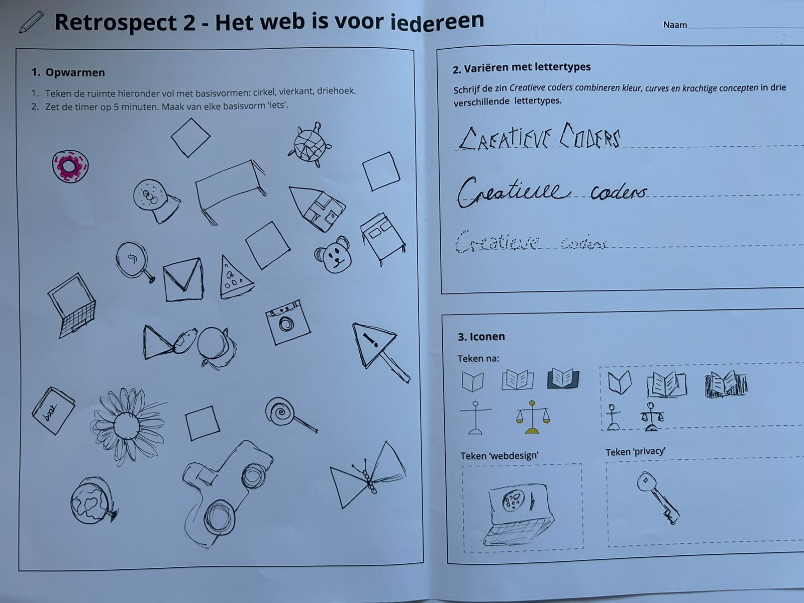

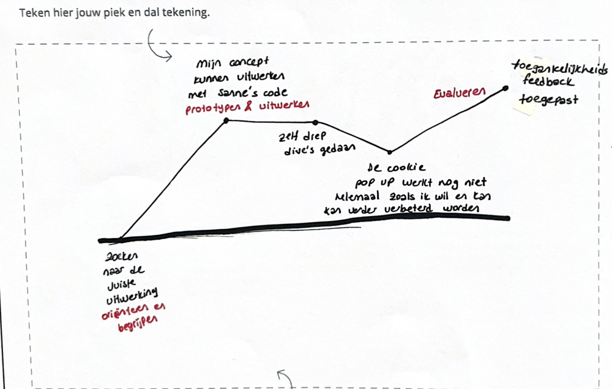

Aan het begin van deze sprint was ik nog op zoek naar de juiste uitwerking van mijn concept.

Een belangrijk hoogtepunt was dat ik mijn concept beter kon uitwerken met behulp van Sanne’s code.

Daarna heb ik zelf deep dives gedaan en samenvattende notities gemaakt. Dit hielp mij om beter te begrijpen hoe ik mijn website verder wilde ontwikkelen.

Een klein dieptepunt was de cookie pop-up. Deze werkt nog niet helemaal zoals ik wil en kan verder verbeterd worden.

Na de feedback over toegankelijkheid kon ik opnieuw naar mijn ontwerp kijken en verbeteringen toepassen. Ook hebben we de screenreader getest en deze werkte goed.

Tijdens deze sprint heb ik aan verschillende CMD-competenties gewerkt:
 Oriënteren en begrijpen : Ik heb zelf deep dives gedaan en informatie samengevat.
Verbeelden en conceptualiseren : Ik heb mijn oorspronkelijke concept opnieuw uitgewerkt en vier verschillende thema’s toegevoegd.
Prototypen en uitwerken: Ik heb mijn ideeën verder uitgewerkt in HTML en CSS.
Evalueren: Ik heb feedback gebruikt om mijn website te verbeteren en de toegankelijkheid getest met een screenreader.

 Metafoor – Langzaam maar zeker vooruit

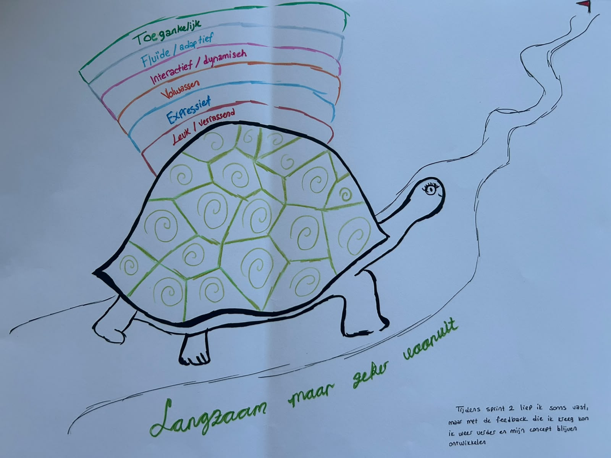

Voor deze retrospect koos ik een schildpad als metafoor.

De schildpad staat voor mijn manier van werken tijdens deze sprint. Ik ging niet altijd snel vooruit en liep soms vast, maar ik bleef wel stap voor stap verdergaan.

Op de rug van de schildpad staan de punten waarop ik mijn ontwerp beoordeel:
toegankelijk
fluïde / adaptief
interactief / dynamisch
volwassen
expressief
leuk / verrassend

De weg omhoog laat zien dat ik nog niet klaar ben, maar wel steeds dichter bij mijn doel kom.

### Wat neem ik mee naar de volgende sprint?

In de volgende sprint wil ik:

de cookie pop-up toegankelijker maken;
meer duidelijke keuzes toevoegen;
de knoppen voor thema en seizoen beter laten passen bij de rest van de website;
bij Mijn Album uitleggen waarom ik bepaalde foto’s heb gekozen;
mijn thema’s verder verfijnen;
blijven testen met de screenreader;
mijn persoonlijke concept verder uitwerken.

## Donderdag 1 oktober

Vandaag ben ik verder gegaan met de feedback uit de toegankelijkheidstest van gisteren.

Ik heb eerst de boekenpagina aangepast. De tijdelijke boektitels en lege afbeeldingen heb ik vervangen door mijn echte favoriete boeken. Ook heb ik de alt-teksten duidelijker gemaakt. In plaats van teksten zoals `Boek 1` gebruik ik nu bijvoorbeeld `Boekomslag van Jane Eyre`, zodat een screenreader beter kan vertellen om welk boek het gaat.

De boektitels zagen eerst uit als buttons, terwijl ze niet klikbaar waren. Daarom heb ik de achtergrond, padding en afgeronde hoeken weggehaald. Ook heb ik de boeken kleiner gemaakt en in een grid gezet, zodat er op een groot scherm drie boeken naast elkaar staan.

### Before - boekenpagina

De boekenpagina had nog tijdelijke titels en de boektitels leken op buttons.

### After - boekenpagina

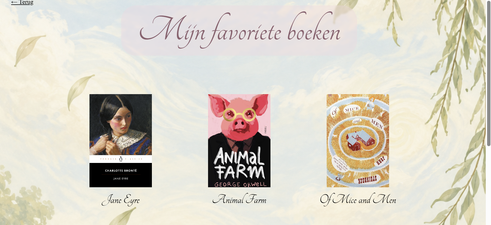

Ik heb mijn echte favoriete boeken toegevoegd, de alt-teksten duidelijker gemaakt en de boeken in een grid gezet.

Op de homepage heb ik de links naar `Mijn favoriete boeken` en `Momenten door mijn lens` aangepast. Eerst leken ze veel op buttons. Daarna heb ik ze eenvoudiger gemaakt, zodat ze meer als links herkenbaar zijn.

### Before - homepage

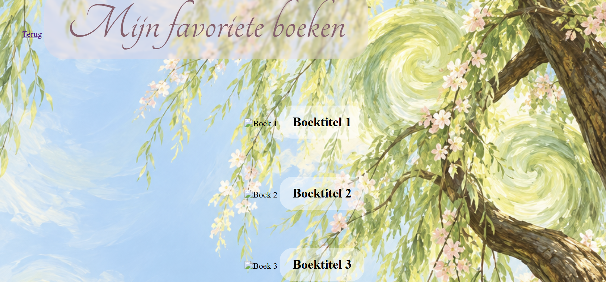

De links op de homepage leken eerst veel op buttons.

### After - homepage

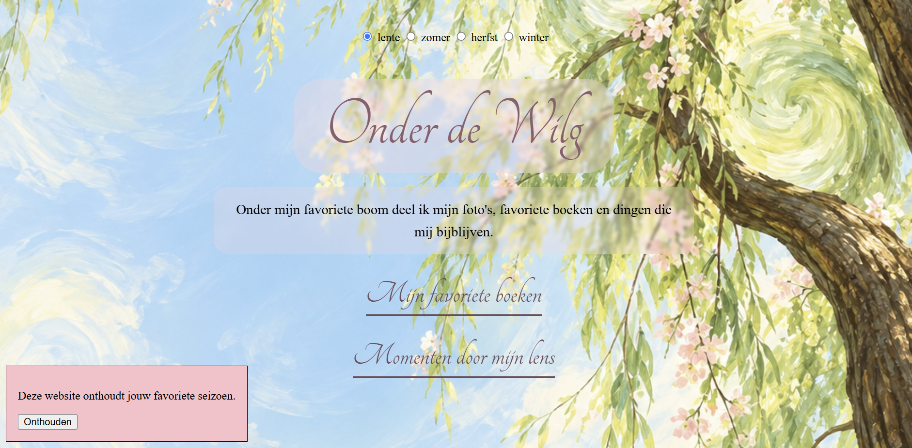

Ik heb de links aangepast zodat ze duidelijker als links herkenbaar zijn.

Daarna ben ik begonnen met mijn albumpagina. Voor de eerste versie heb ik drie eigen foto's gekozen. De foto's staan naast elkaar in een grid en ik heb bij elke foto een beschrijvende alt-tekst toegevoegd, zodat de afbeeldingen ook duidelijk zijn voor een screenreader.

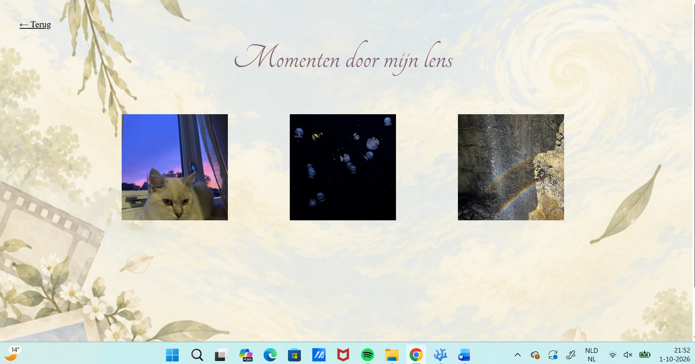

Ik wil later nog meer foto's toevoegen en de albumpagina verder uitbreiden.

Ik wil de boeken later ook interactiever maken. Ik wil hover-states toevoegen en ervoor zorgen dat je op een boek kunt klikken. Dan wil ik laten zien wat het boek bij mij opriep, wat ik ervan vond of een korte quote die mij is bijgebleven.

## Woensdag 30 september

Vandaag heb ik samen met Seb mijn website getest op toegankelijkheid. Op dat moment was mijn website nog niet helemaal af. De boekenpagina had nog geen echte boekafbeeldingen en er stonden tijdelijke teksten zoals `Boektitel 1`, `Boektitel 2` en `Boektitel 3`. Deze teksten stonden in afgeronde vlakken en leken daardoor op buttons, terwijl ze niet klikbaar waren.

Ook waren de alt-teksten van de afbeeldingen nog te algemeen, bijvoorbeeld `Boek 1`. Met een screenreader was daardoor niet duidelijk om welk boek het ging. Op de homepage zagen de links naar mijn boeken en album er ook uit als buttons. Tijdens de test merkte ik daarom dat ik duidelijker moest laten zien wat een link, button of gewone tekst is.

De basis van de website werkte wel. De pagina had een duidelijke `h1` en de links naar andere pagina's werkten. Ik moest nog verder kijken naar de screenreader, de Tab-volgorde, focus-states en het contrast van de tekst met de achtergrond.

Waar staat WCAG en A11y voor?

WCAG staat voor Web Content Accessibility Guidelines. A11y is een korte manier om accessibility te schrijven.

Wat vind je lastiger: toetsenbord of screenreader?

Ik vind een screenreader lastiger, omdat ik dan meer moet luisteren en onthouden waar ik ben. Ik moet vooral nog oefenen met de shortcuts.

Met welke beperking rekening houden vind je het meest lastig?

Ik vind screenreader-gebruikers het lastigst. Soms ziet iets er goed uit, maar is het zonder beeld toch niet duidelijk. Ik merk wel dat ik nog steeds mooie dingen kan ontwerpen als ik eerst zorg dat de basis toegankelijk is.

### Door een paar problemen heb ik mijn learning log tussen deze twee data niet goed kunnen bijwerken. In deze periode heb ik wel verder gewerkt aan mijn website, maar ik heb niet alles meteen kunnen toevoegen aan mijn README.Ik wil deze ontbrekende stappen zo snel mogelijk aanvullen en mijn learning log weer helemaal bijwerken.

## 18 september – Feedback Sprint 1 + Retrospect

Aan het einde van sprint 1 kreeg ik feedback van Sanne op mijn Digital Garden.

### Feedback van Sanne

Je oorspronkelijke idee – jouw wilg centraal – was/is interessant.
Het is nog niet gelukt om dat idee goed te realiseren.  
Op dit moment is het een prima website, maar nog best algemeen.  
Probeer weer meer van je oorspronkelijke idee toe te voegen.  

Google Fonts is verboden in Europa. Gebruik daarom `@font-face`.

In mijn eerste idee wilde ik de wilg echt centraal zetten in mijn website. Tijdens het uitwerken liep ik alleen vast met HTML en CSS. Daardoor lukte het mij nog niet om mijn concept te maken zoals ik het in mijn hoofd had.

Ik heb daarom tijdelijk gekozen voor een eenvoudigere en algemenere website. De website werkte wel, maar mijn eigen concept en sfeer waren nog niet duidelijk genoeg terug te zien.

Ook had mijn website op dat moment nog geen echte thema's. In de volgende sprint wil ik daarom meer werken aan de visuele stijl en verschillende thema's toevoegen, zodat de website beter past bij het idee van **Onder de Wilg**.

Daarnaast ga ik Google Fonts vervangen door een lokaal lettertype met `@font-face`.

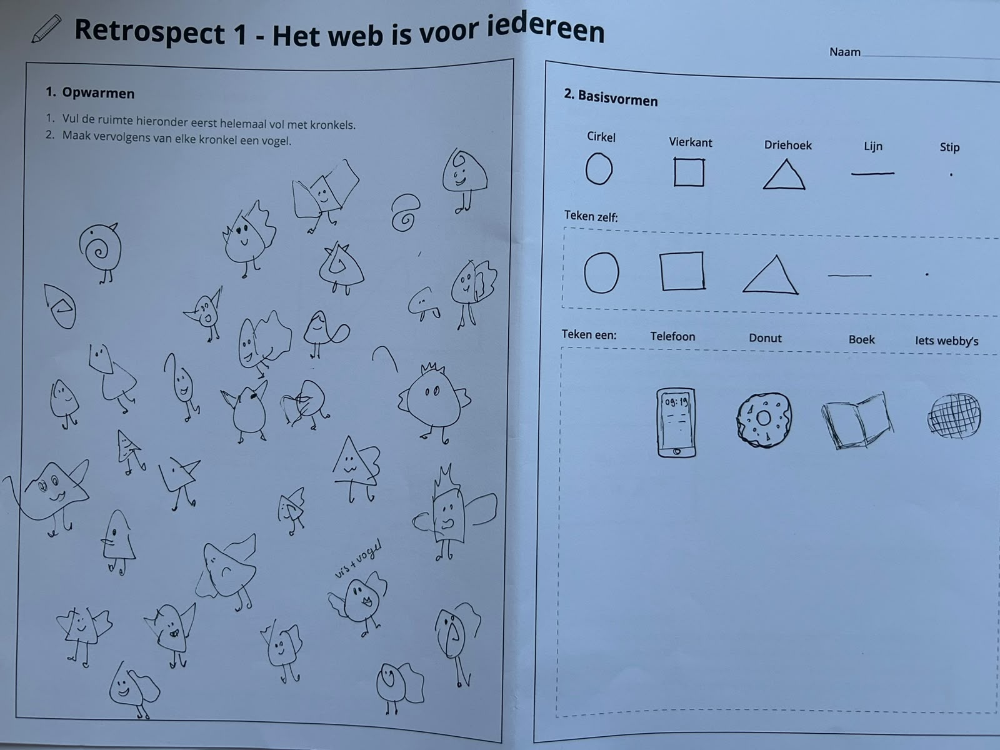
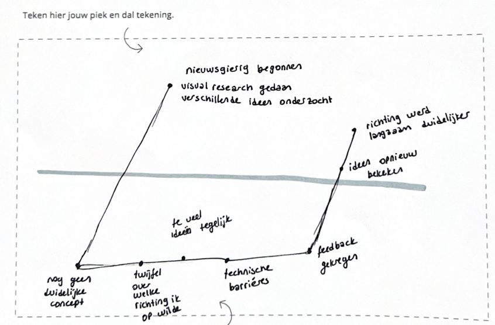

Aan het begin was ik nieuwsgierig en deed ik veel visual research. Ik onderzocht verschillende ideeën, maar ik had nog geen duidelijk concept.

Daarna begon ik te twijfelen over welke richting ik wilde kiezen. Ik had veel ideeën tegelijk en liep ook tegen technische problemen aan. Hierdoor vond ik het moeilijk om mijn ideeën om te zetten naar HTML en CSS.

Na het krijgen van feedback begon mijn richting langzaam duidelijker te worden. Ik kon opnieuw naar mijn ideeën kijken en beter bepalen wat ik in de volgende sprint wilde verbeteren.

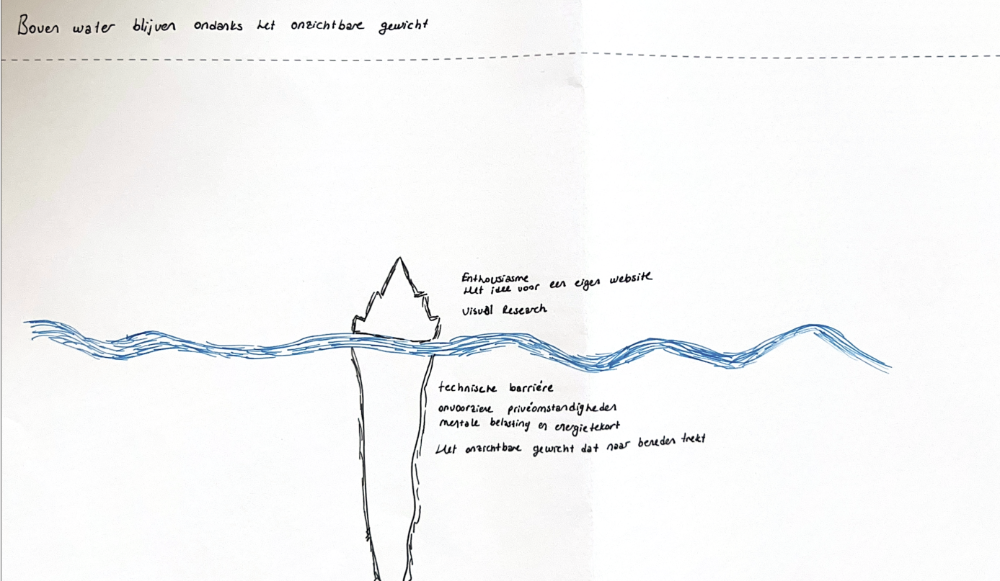
Voor mijn retrospect heb ik een ijsberg gebruikt als metafoor.

Boven water staan de dingen die zichtbaar waren, zoals mijn nieuwsgierigheid, ideeën en visual research.

Onder water zitten de dingen die minder zichtbaar waren, maar wel veel invloed hadden op mijn proces. Bijvoorbeeld technische barrières, twijfel, vastlopen en moeite hebben om mijn idee uit te werken.

De ijsberg laat zien dat er achter een eenvoudige website veel meer zat dan aan de buitenkant zichtbaar was.

### Wat neem ik mee naar Sprint 2?

In sprint 2 wil ik:

- mijn oorspronkelijke wilg-concept weer duidelijker terugbrengen;
- een sterkere en persoonlijkere visuele stijl maken;
- thema's toevoegen aan mijn website;
- mijn HTML en CSS verder verbeteren;
- feedback gebruiken om mijn concept stap voor stap verder uit te werken;
- Google Fonts vervangen door `@font-face`.

### 16 september

Vandaag heb ik opnieuw naar mijn concept gekeken. Ik merkte dat mijn eerdere ideeën visueel leuk waren, maar dat ze op mobiel te druk konden worden en niet altijd goed pasten bij de criteria zoals fluid/adaptief, toegankelijk en duidelijk.

Ik liep ook een beetje vast, omdat ik mijn concept niet goed kon uitwerken in HTML en CSS. Daardoor werd ik gestrest en begon ik te twijfelen of mijn idee niet te moeilijk was om te maken.

Daarom heb ik besloten om terug te gaan naar een simpelere basis. Ik heb gekozen voor een rustige homepage met een paar duidelijke onderdelen die je kunt aanklikken. Dit is makkelijker om responsive te maken en beter uit te werken met HTML en CSS.

Ik heb deze vorm gekozen omdat hij simpel genoeg is om nu goed te bouwen, maar nog steeds ruimte geeft om later mijn eigen stijl, foto's, boeken en andere persoonlijke dingen toe te voegen.

### 14 september

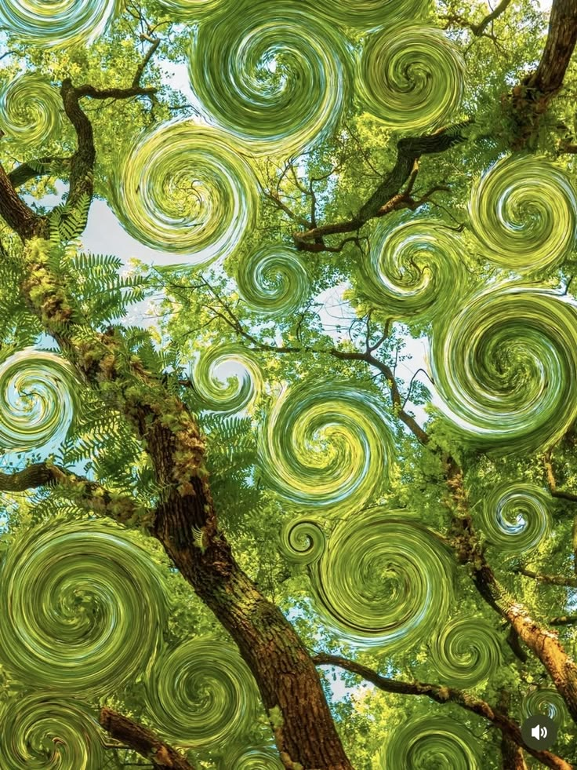

*Dit beeld heb ik op Pinterest gevonden als inspiratie voor mijn nieuwe concept.*

Checkout

Ik kreeg als feedback dat mijn eerste idee met de boom en de boeken wat te druk en ingewikkeld was. Daarom ben ik opnieuw gaan kijken naar mijn concept en heb ik het simpeler gemaakt met de boom en klikbare spiralen.
   

## Learning Log
Op 11 september heb ik mijn README gekoppeld aan VSCodium. Daarna ben ik mijn Learning Log ook voor de eerdere dagen gaan invullen. Ik probeer alles nog terug te halen, maar er missen nog een paar dingen 

### 11 september

Vandaag heb ik verder nagedacht over het concept van mijn Digital Garden. Mijn eerste idee was om te werken met een groot beeld van een boom, waarin ik boeken wilde plaatsen. Ik dacht eraan om de boeken klikbaar te maken en de pagina’s als het ware om te slaan, zodat de bezoeker per boek iets kon lezen of ontdekken. Op die manier wilde ik verschillende onderdelen van mijn Garden laten zien.

Na feedback van Sanne ben ik opnieuw naar mijn concept gaan kijken. Hij zei dat de combinatie van een boom en boeken misschien te veel verschillende elementen tegelijk bevatte en daardoor wat druk of onduidelijk kon worden. Daardoor ben ik opnieuw gaan nadenken over wat ik precies wilde laten zien en welke vorm daar het beste bij past.

Daarna heb ik op Pinterest lang gezocht naar beelden die beter bij mijn idee pasten. Ik zocht iets dat te maken heeft met natuur, groei, beweging en ontdekken. Uiteindelijk heb ik een beeld gekozen van bomen met groene spiralen erin. Dit sprak mij aan, omdat de spiralen voor mij passen bij mijn sfeerwoord ´´onderzoekend´´. Ze geven het gevoel van beweging, verschillende richtingen en steeds iets nieuws ontdekken.

Met dit beeld ben ik verder gaan denken over een nieuw concept. In plaats van boeken in een boom wil ik nu liever werken met een boom of natuurlijke vorm waarin klikbare spiralen zitten. Elke spiraal kan dan naar een ander onderdeel van mijn Digital Garden leiden. Zo blijft het idee speels en persoonlijk, maar ook rustiger en duidelijker.

### 9 september

Vandaag heb ik mijn eerste presentatie over mijn Digital Garden gemaakt. Daarna heb ik via Teams met Giel gesproken en hebben we elkaar vragen gesteld over onze ideeën en onderwerpen.

**Wat is voor jou de essentie van wat je hebt gepresenteerd?**  
Voor mij gaat het vooral over ontdekken, veranderen en dingen die bij mij passen. Ik wil laten zien hoe mijn interesses en ideeën zich ontwikkelen.

**Welke woorden uit de kwaliteitenlijst passen bij je onderwerp?**  
Onderzoekend, persoonlijk, open en rustig.

**Heeft de ander een aanvulling op je onderwerp?**  
Ja, door het gesprek kreeg ik het idee dat ik mijn onderwerp niet te groot hoef te maken. Ik kan beginnen met een paar persoonlijke dingen en het later uitbreiden.

**Wat is het karakter of gevoel dat bij je onderwerp past?**  
Persoonlijk, rustig, nieuwsgierig en een beetje speels.

**Welke inspiratie haal je uit je 25 afbeeldingen?**  
Ik zie veel natuurlijke vormen, verschillende kleuren, typografie en beelden die niet helemaal perfect of strak zijn. Dat past goed bij het idee van ontdekken en veranderen.

**Wat wil je vertellen met je Digital Garden?**  
Ik wil vooral laten zien wat mij interesseert en wat ik onderweg ontdek. Ik wil dit doen met eigen foto's, korte teksten, beelden en misschien kleine interactieve dingen.

**Mijn eerste idee:**  
Ik wil mijn Digital Garden laten gaan over mijn interesses, ontdekkingen en persoonlijke ontwikkeling.  
Ik wil dat laten zien door foto's, korte teksten en beelden te tonen.  
Ik begin met eigen content over mijn favoriete boeken, foto's en mijn boom.  
Later kan ik mijn Garden verder uitbreiden met nieuwe dingen die ik leer, maak of ontdek.

Daarna heb ik in Miro visueel onderzoek gedaan voor mijn Digital Garden. Ik begon met het sfeerwoord ´´zoekend´´, maar na feedback heb ik dit veranderd naar ´´onderzoekend´´.

Ik heb op Pinterest ongeveer 25 afbeeldingen verzameld die bij mijn onderwerp en sfeer passen. Ik heb vooral gekeken naar vormen, kleuren, beweging, ritme en verschillende stijlen.

Uit deze beelden heb ik kenmerken gehaald zoals vloeiend, bewegend, herhaling, verschillende richtingen en onverwachte vormen. Daarna heb ik met deze kenmerken kleine schetsen gemaakt.

Als laatste heb ik mijn schetsen beoordeeld op punten zoals toegankelijkheid, interactie, expressie en of het verrassend genoeg was. Zo kon ik beter zien welke ideeën ik verder wil gebruiken voor mijn Digital Garden.

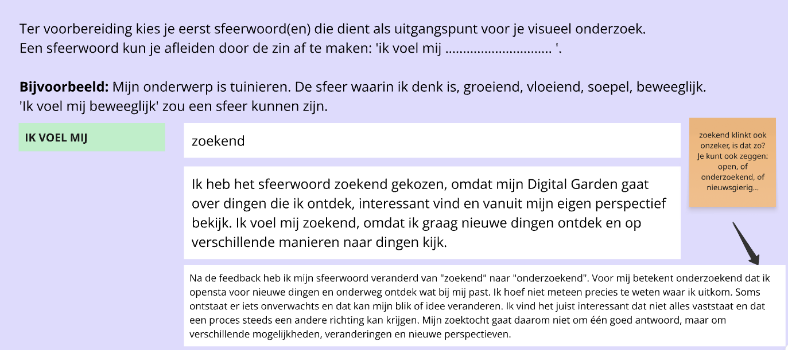

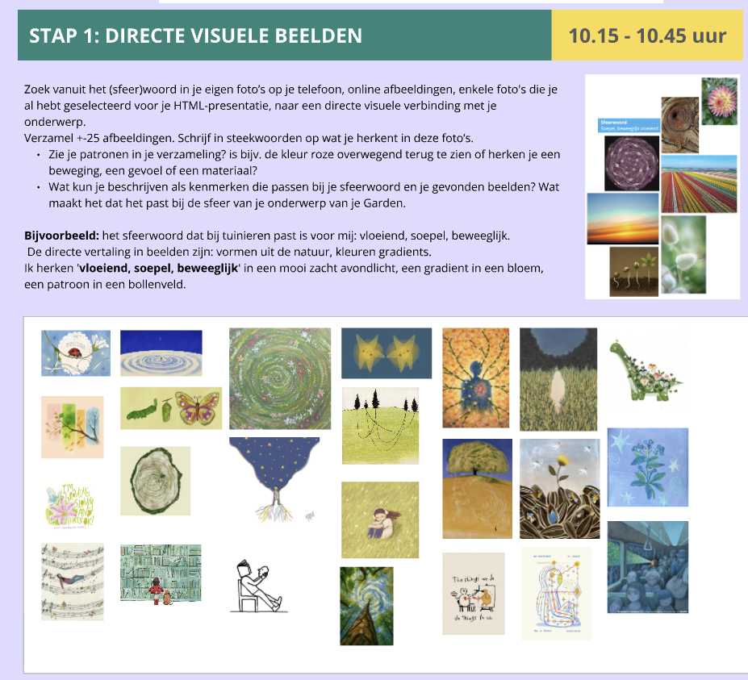

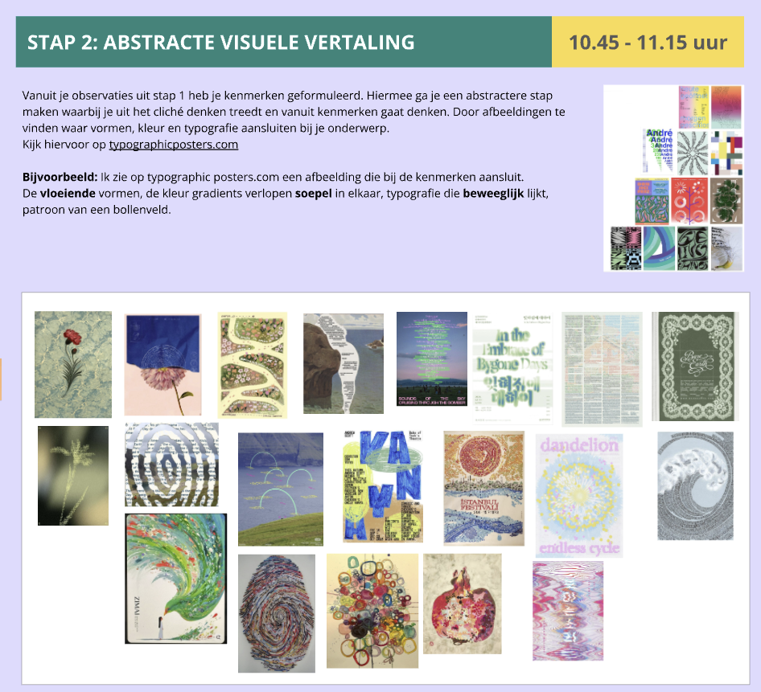

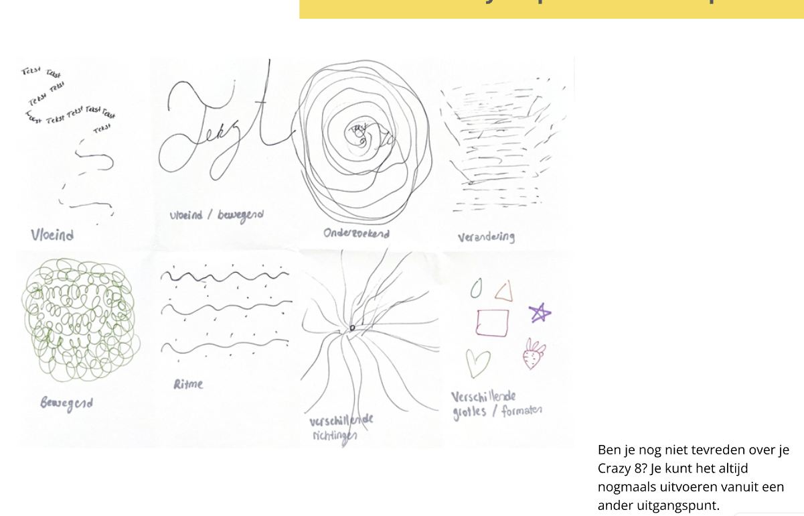

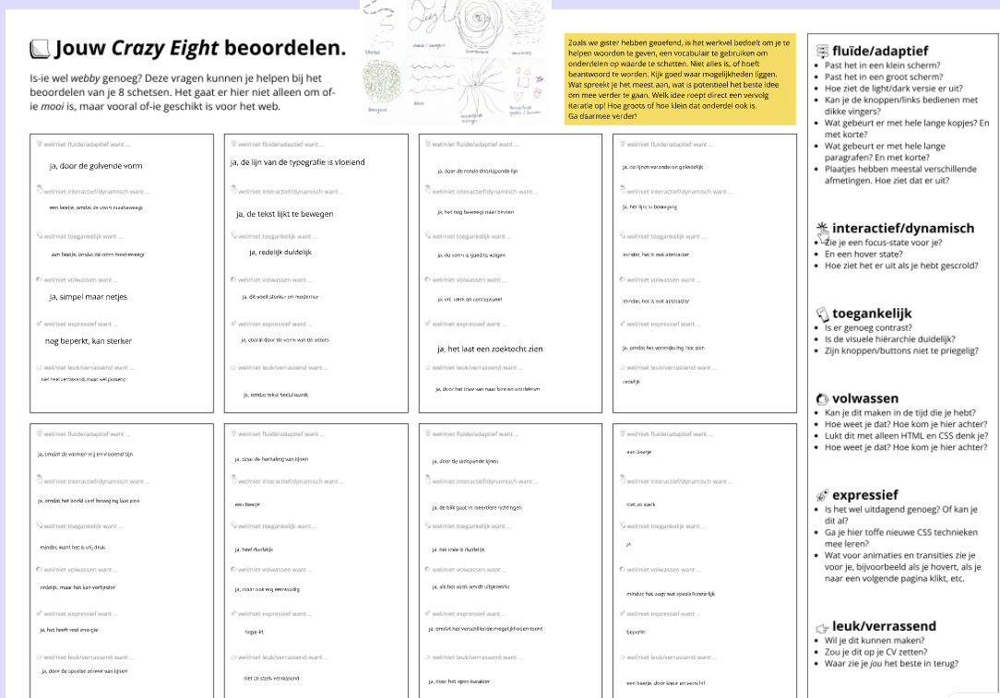

### Check-out

Het Visual Research helpt mij om van inspiratie naar een duidelijker visueel idee te gaan.

Mijn Digital Garden gaat over dingen die ik ontdek en interessant vind. Ik wil dit laten zien met foto’s, korte teksten en kleine interactieve elementen.

Van mijn Crazy 8 wil ik vooral het idee met vloeiende lijnen en verschillende richtingen verder onderzoeken.

### 7 september

Vandaag hebben we de tekst *A Brief History & Ethos of the Digital Garden* gelezen.

Een digital garden is een persoonlijke plek op het internet waar je ideeën, interesses, notities en dingen die je leert kunt verzamelen. Het verschil met een gewone blog is dat een digital garden niet alleen uit afgewerkte berichten bestaat. Je kunt ook ideeën delen die nog niet helemaal af zijn en deze later aanpassen.
De inhoud hoeft ook niet op datum te staan. Onderwerpen kunnen met elkaar verbonden worden en zo ontstaat er langzaam een soort netwerk van ideeën. Een digital garden groeit dus steeds verder en verandert mee met wat je leert en ontdekt.

Daarna hebben we verschillende persoonlijke websites bekeken en beoordeeld op punten zoals fluid/adaptief, interactief, toegankelijkheid, expressief en verrassend.

**silly.possiblyaxolotl.com**
1-Fluid/adaptief: de website heeft veel onderdelen en links, maar blijft duidelijk opgebouwd.
2-Interactief/dynamisch: er zijn veel links en onderdelen waar je op kunt klikken.
3-Toegankelijkheid: de tekst is duidelijk, maar door de drukke stijl kan het soms wat onrustig zijn.
4-Expressief: heel sterk. De website heeft duidelijk een eigen stijl en persoonlijkheid.
5-Leuk/verrassend: ja, omdat het heel anders voelt dan een normale website.

**bonics.org/aboutme**
1-Fluid/adaptief: de pagina bestaat uit veel losse visuele elementen.
2-Interactief/dynamisch: er zijn verschillende buttons en onderdelen om te ontdekken.
3-Toegankelijkheid: door de vele afbeeldingen is niet alles meteen even duidelijk.
4-Expressief: heel persoonlijk en creatief vormgegeven.
5-Leuk/verrassend: ja, omdat je steeds nieuwe kleine dingen tegenkomt.

Checkout

1.Een digital garden is een persoonlijke website waar je ideeën, interesses en dingen die je leert kunt verzamelen. Het verschil met een gewone website is dat niet alles af hoeft te zijn. Je kunt dingen later veranderen en verder ontwikkelen.

2.Een website voelt voor mij 'webby' als je merkt dat er echt iets persoonlijks en creatiefs in zit. Niet alles hoeft strak en standaard te zijn. Ik vond vooral websites inspirerend waar je veel kleine dingen kunt ontdekken en waar de maker duidelijk zijn eigen stijl laat zien.

3.Voor mijn eigen digital garden wil ik beginnen met dingen die bij mij passen, zoals foto's, boeken, inspiratie en dingen die ik leer. Ik wil eerst een simpele persoonlijke website maken en later kijken hoe ik die verder kan uitbreiden.

### 31 aug - Kickoff

Een fork van de model repository gemaakt en gepubliceerd via mijn eigen Github omgeving...
